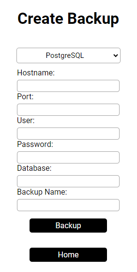
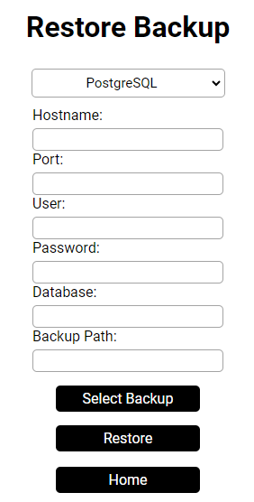
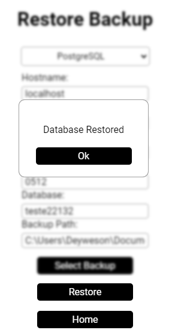

# SQL Backup Tool

Ferramenta para realizar **backups** e **restaurações** de bancos de dados SQL, com suporte para **MySQL** e **PostgreSQL**.

## Funcionalidades

- **Backup** de bancos de dados:
  - Suporta **MySQL** e **PostgreSQL**.
  
- **Restauração** de backups:
  - Suporta **PostgreSQL** (a funcionalidade de restore para MySQL ainda está em desenvolvimento).

## Bancos Suportados

- **MySQL**
- **PostgreSQL**

## Testado nas seguintes versões

- **PostgreSQL**: 16.6.1
- **MySQL**: 8.0.40

## TODO

- [ ] **Salvar os dados de backup/restauração** no **localstore** para tornar o processo mais dinâmico.
- [ ] **Implementar a funcionalidade de restauração para MySQL**.
- [ ] **Realizar testes das funcionalidades** para garantir a estabilidade e correção do sistema.

## Contribuições

Se você deseja contribuir com o projeto, fique à vontade para abrir **issues** ou **pull requests**.

Uma das formas de contribuir é testando em versões alternativas e enviando os resultados através de **issues**.

## Licença

Este projeto está licenciado sob a licença MIT.

# Imagens do Projeto

  
  
  
  
  
  
  
  
  

