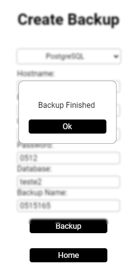

# Como usar SQL Backup Tool

## Realizando Backup 

Preencha todos os campos:
- Hostname: hostname do seu banco
- Port: porta do seu banco 
- User: seu usuário
- Password: sua senha
- Database: nome do seu banco
- Backup Name: nome do arquivo de backup

Depois basta clicar em **Backup** e aguarda finalziar o procedimento

<div style="display: flex; flex-wrap: wrap; ">
  
  
</div>

O Seguinte comando é realizado para criar o backup:
```shell
## PSQL
[caminho do bin] -h [hostname] -p [port] -U [user] -F t -d [database] -f [caminho do backup]
## MYSQL
[caminho do bin] -h [hostname] -P [port] -u [user] [database] > [caminho do backup]
```


## Realizando a Restauração do Backup

Preencha todos os campos:
- Hostname: hostname do seu banco
- Port: porta do seu banco 
- User: seu usuário
- Password: sua senha
- Database: nome do seu banco
- Backup Path: caminho do arquivo de backup

O Backup Path pode ser selecionado clicando em **Select Path** ou inserindo manualmente


<div style="display: flex; flex-wrap: wrap; ">
  
  
</div>

Caso o Banco de dados passado ainda não exista, ele sera criado automaticamente e logo apos restaurado o backup

Os Seguintes comandos são realizado para restaurar o backup:
```shell
## PSQL

[caminho do bin] -h [hostname] -p [port] -U [user] -c "CREATE DATABASE IF NOT EXISTS [database];"
[caminho do bin] -h [hostname] -p [port] -U user -d [database] -1 [caminho do backup]

## MYSQL

[caminho do bin] -h [hostname] -P [port] -u [user] -e "CREATE DATABASE IF NOT EXISTS [database];"
[caminho do bin] -h [hostname] -P [port] -u [user] [database] < [caminho do backup]
```
